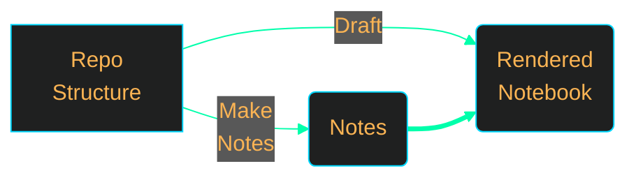
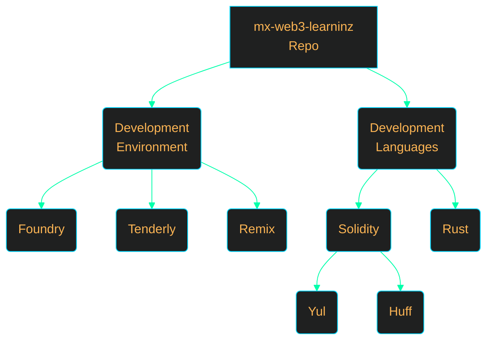
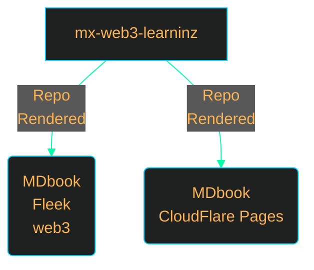

<h1>TOC</h1>

1. [🍌 Repo Description](#-repo-description)
   1. [Goal](#goal)
   2. [Directories](#directories)
   3. [Tools](#tools)
2. [Concepts Investigation Plan](#concepts-investigation-plan)
3. [Books](#books)
4. [🍌 Disclaimer](#-disclaimer)

# 🍌 Repo Description 

1. This repo is a workbook of all my web3 related learning endeavors 
2. It can also include concepts that are not directly related to web3 , but has some relationship with them
   
## Goal 

1. Get better at bug hunting.
2. Understand Secure Engineering.
3. Build web3 related security tools.

## Directories

Explanation of what the directories are 

1. [`/ld/`](./ld/) - Each project in seperate subfolder for tracking
2. [`/ebuk/`](./ebuk/) - Contents of my MD notebook

## Tools 

Stuff I use all the time when working on this repo 

N | URL | Description
|:--:|:--:|:--:|
1 | [Mermaid Live](https://mermaid.live/) | Live mermaid wysiwyg editor for diarams code generation 
2 | [Mermaid JS](https://mermaid-js.github.io/) | Reference Manual 

# Concepts Investigation Plan 

WIP

# Books 

*Image link map* - Click box

$Cloudflare \ Pages \ is \ a\ much\ faster\ than\ fleek$

# 🍌 Disclaimer 

Everything in this repo will undergo constant changes. The informatin cannot considered to be accurate or useful at any given moment in time. #DYOR 