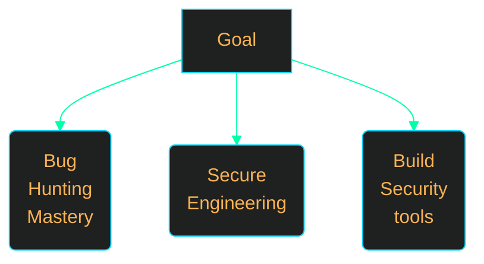
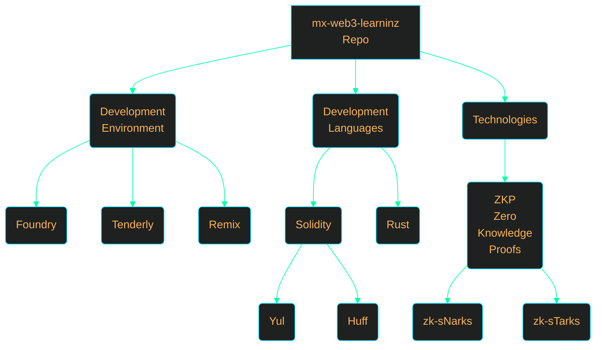
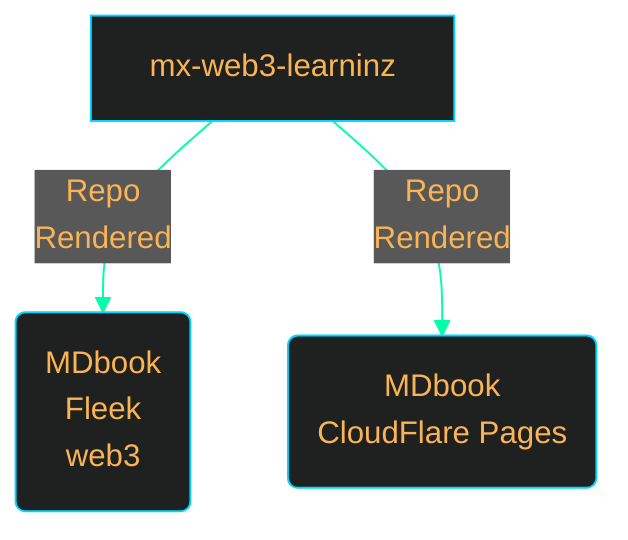

<h1 align="center">TOC</h1>

1. [🍌 Repo Description](#-repo-description)
   1. [Goal](#goal)
2. [Concepts Investigation Plan](#concepts-investigation-plan)
3. [Books](#books)
4. [🍌 Disclaimer](#-disclaimer)

---
# 🍌 Repo Description 

1. This repo is my workbook notes from the investigation of $web3 \ Security \ Concepts$
2. Access the book from [Section - Books](#books)
3. Since these areas being actively investigated, the concepts and written matter can be completely removed or edited at any time. 
   
## Goal 

# Concepts Investigation Plan 

WIP

# Books 

*Image link map* - Click relevant box to access ebook

$Cloudflare \ Pages \ is \ a\ much\ faster\ than\ fleek$

# 🍌 Disclaimer 

Everything in this repo will undergo constant changes. The informatin cannot considered to be accurate or useful at any given moment in time. #DYOR 